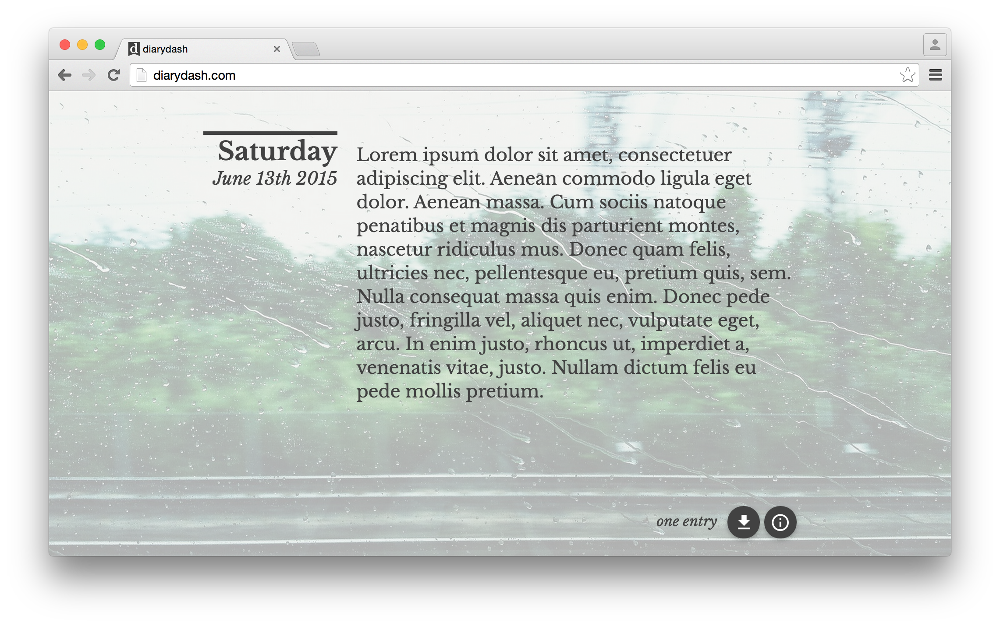

#diarydash

Write your diary in your browser. Everyday you are presented with a blank page.
Your entries are saved locally using HTML5 local storage. All entries can be accessed in a single markdown file using the controls at the bottom of the page.

## Software used

+ [materialize](http://materializecss.com)
+ [Moment.js](http://momentjs.com)
+ [jQuery](https://jquery.com)
+ [Piwik](http://piwik.org)
+ [autosize script by jackmoore](https://github.com/jackmoore/autosize)
